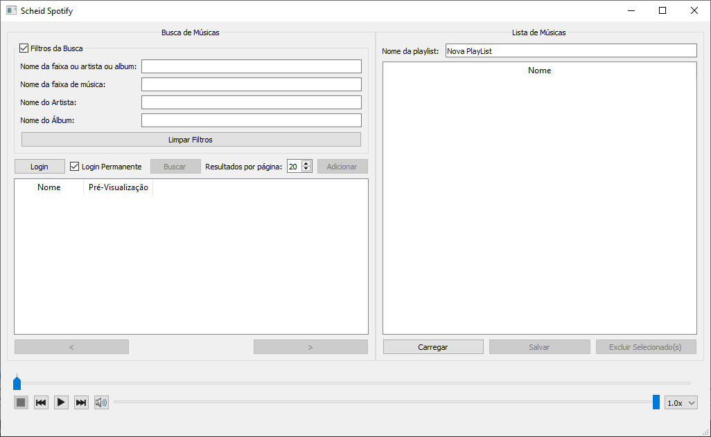

<p align="center">
    
</p>



[](
https://github.com/avs009/scheid-spotify/actions/workflows/ubuntu.yml)
[](
https://github.com/avs009/scheid-spotify/actions/workflows/windows.yml)

An unofficial Spotify client as a showcase for Qt framework.

## Supported platforms

Tested: Linux, Windows with Qt 5.12

Supported: macOS, *BSD, Haiku, any
platform [officially supported](https://en.wikipedia.org/wiki/List_of_platforms_supported_by_Qt) by
Qt

Requirements:

For Windows:

- Qt for MinGW x64 (Tested with, but can be compiled with MSVC or UWP), Qt Network Authorization

For Linux:
- apt-get install qt5-default libqt5network5 libqt5networkauth5 libqt5multimedia5 libqt5multimediawidgets5 libqt5multimedia5-plugins

## Building yourself

Make sure you have Qt (5.12+) with CMake (3.5+) and various build tools like
`make`, `g++` and `git`. Keep in mind that the master branch is unstable at all times.
Therefore, it's recommended to use the stable branch, which is updated after each new stable
release, only including important bug fixes, unless you want to try out new features.

```
git clone --branch stable https://github.com/avs009/scheid-spotify.git
cd scheid-spotify
mkdir build
cd build
cmake ..
make
./ScheidSpotify
```
